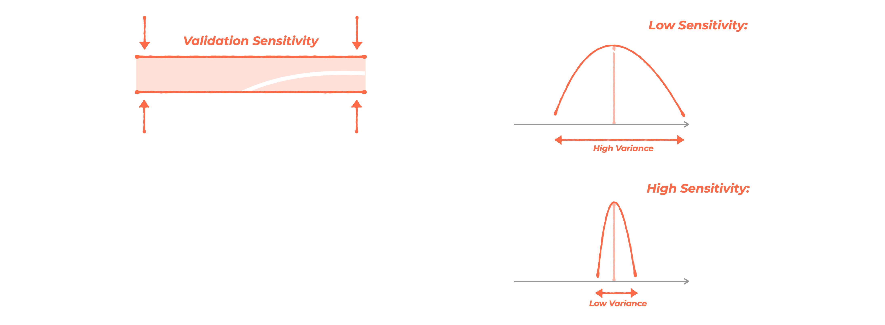

# Model selection via t-test

Comparing models based on the average score of a metric on fouls is not a good approach.   It is more correct to apply a statistical test. After cross-validation, we don't get a single value, but a sample of values.  So let's compare one sample (estimates on fouls on baseline) with other samples (estimates on fouls for each model).

We will also try a different cross-validation scheme. In addition to KFold, we will try the RepeatedKFold scheme. Its difference is that the dataset is split into folds not once, as in KFold, but several times, specified in the n_repeats parameter. At each iteration of n_repeats, the dataset is re-mixed with another random_state. Thus, for 5 folds and 3 repeats, we get already 15 folds.

Scatter and sensitivity
The 5x3 validation scheme described above is a small bootstrap. We sample subsamples several times, calculate the averages in each subsample (fold). The result is a distribution of averages across folds. Now we can compare samples to each other, not point estimates.

We know what the spread of the metric on fouls is, we understand what the sensitivity is, and so we can estimate which changes will be statistically significant "catches" and which are just noise.

Let us compare two examples of the distribution of the model metric over fouls. Let's assume that these distributions are obtained using different versions of the model.

In both examples, the difference between the averages over fouls is the same. In the previous step, we simply compared the averages, and decided that the new version of the model increases the value of the metric.

But in the first example (Low Sensitivity), you can see that the spread (variance) is much larger than in the second example (High Sensitivity). Even with the "unarmed eye", in the second example we can confidently state the fact that the value of the metric is indeed higher. In the first example, on the contrary, the difference of the metric is within the margin of error.

The more iterations the algorithm has made, the smaller and smaller increase in the metric we can confidently fix.

The same statement is true in a global context. The longer we engage in modeling, the smaller and smaller improvements we get. At first, we are after large qualitative changes and there we can not "worry" about RepeatedKFold. But with each step (increasing time), the changes become less and less noticeable.

## Statistical t-test
To evaluate whether the value of the metric has increased significantly or not, let's use the statistical t-test for related (dependent samples). It is already implemented in the scipy library (link to documentation).

We will estimate p-value with a significance level alpha=0.05. In 5% of cases, we assume that we "catch" an effect where it is not actually present.

If the p-value is less than the significance level and the average of the folds is higher than for the baseline, then the model is better than the baseline. Let's set its effect_sign = 1
If the p-value is less than the significance level and the mean on fouls is lower than for the baseline, then the model is worse than the baseline. Let's set it effect_sign = -1
If the p-value is above the significance level, then the model is not statistically significantly different from the baseline. Set it to effect_sign = 0

# What K to Choose for Optimal Cross-Validation?

When measuring the metric on cross-validation, we want to know how well the model performs on new data. But there's an error relative to the unseen data in our measurement, known as the test set's lack of representativeness. This error decomposes into two components - bias (смещение) and variance (разброс).

- **Bias** is the deviation that shows how much our estimation is on average less or more than the actual model quality.
- **Variance** is the deviation that indicates how much dispersion the estimates have across different datasets.

How do bias and variance change depending on the number of folds K?

In some cases, it is more important for us to minimize bias, in others - variance.

General recommendations are as follows:

- If we want to assess the **final quality of the model**, we are interested in the difference between folds. We want to get the most accurate estimate, so our priority is **minimizing bias**. For minimal bias, we need a larger number of folds, for example, 10. Over each of its iterations, the cross-validation model will train on almost all data (each fold – about 90% of the entire selection), which maximizes its accuracy.

- If we want to **compare two models** with each other (for example, before and after feature selection or during hyperparameter optimization), we can overfit to bias. We aim to **minimize variance**. It's most important for us that the scores of the folds are less spread out. We don't need a lot of folds for the distribution of statistical significance to be different. For this stage, we need to increase the number of educational selections in each fold, and the test selection (more data – smaller dispersion of estimates). For example, apply such uneconomical at first glance schemes, like 2x30 instead of 10x10 (20-30 repeated splits into 2-3 folds).

- Due to **repeated splits**, we get more and more folds (more estimates), which automatically reduces variance (as opposed to \( \sqrt{k} \)).

- But such an approach is not practical in all cases because, for example, with **100x5**, all 5 repeated splits will give approximately the same bias (they evaluate approximately the same models, roughly on the same data), and their average – does not change.

